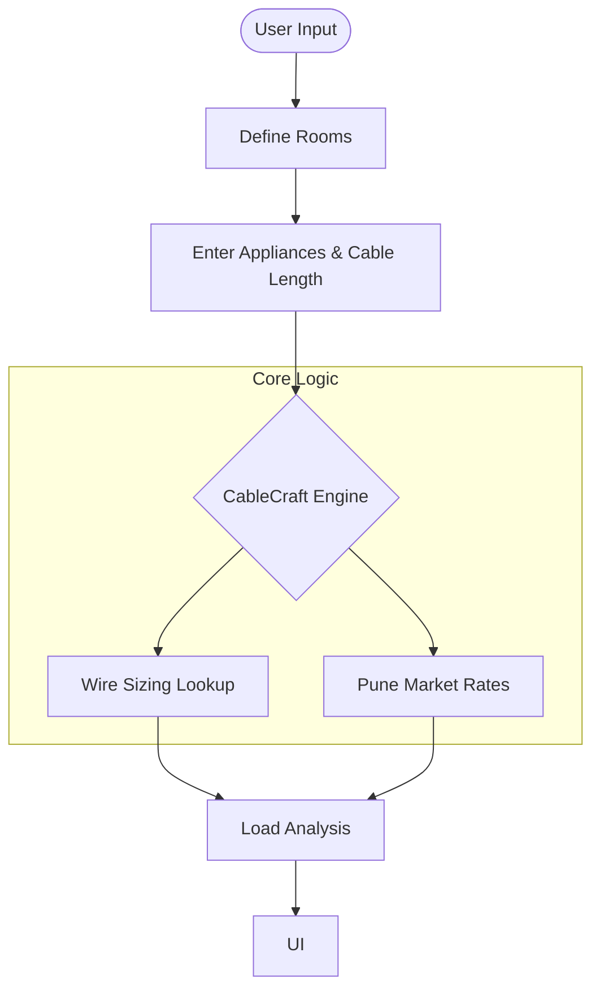

# CableCraft ⚡

**CableCraft** is a high-performance electrical design assistant tailored for technicians and homeowners in Pune, Maharashtra. It simplifies complex load calculations, suggests safe wire sizes, and provides localized cost estimations.

## 🚀 Features

- **Dynamic Load Management**: Add multiple rooms and appliances with custom wattages and quantities.
- **Intelligent Wire Sizing**: Automated lookup of standard copper cable sizes based on current capacity (Amps).
- **Localized Cost Estimation**: Integrated pricing for Pune (INR) including material costs (1.5mm to 16mm) and labor charges per meter.
- **Premium Light Theme**: A clean, 100% width, responsive UI built for both desktop and mobile use.

## 🛠️ Tech Stack

- **HTML5**: Semantic structure for better accessibility.
- **Vanilla CSS3**: Modern design using CSS Variables, Flexbox, and Grid.
- **Vanilla JavaScript**: State-driven architecture for dynamic UI updates and calculations.

## 📊 Technical Workflow

## 📖 Engineering Context

### Wire Sizing References
Sizing is based on Indian standard (IS) current-carrying capacities for FRLS (Flame Retardant Low Smoke) copper cables in conduit @ 230V.

- **1.5 sq.mm**: Up to 12A
- **2.5 sq.mm**: Up to 18A
- **4.0 sq.mm**: Up to 24A
- **6.0 sq.mm**: Up to 32A

### Pricing Reference (Pune/INR)
Rates are based on late 2025 Pune market averages (Finolex/Polycab/RR Kabel):
- **Labor**: ₹15 per meter.
- **Material**: Ranging from ₹20/m (1.5mm) to ₹200+/m (16mm).

---
*Created with ⚡ by Antigravity*
